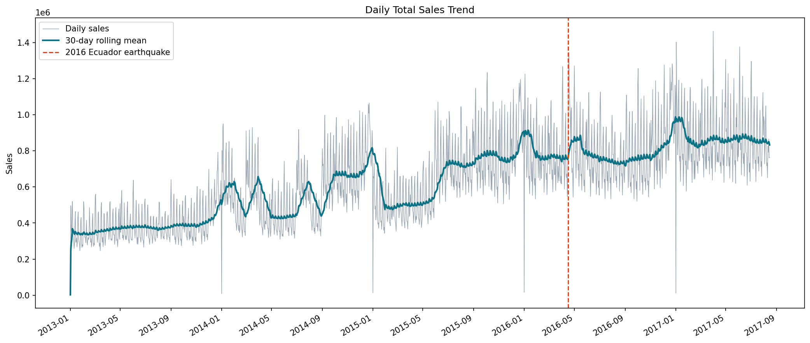
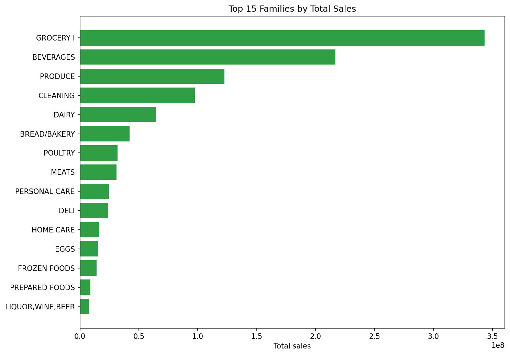
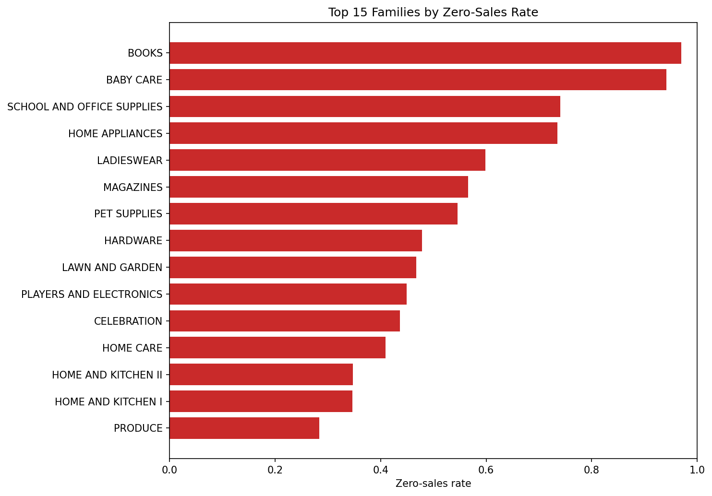
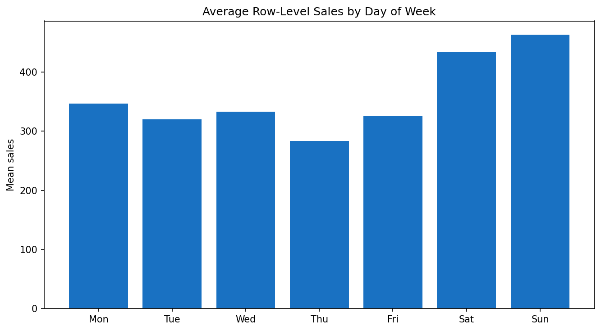
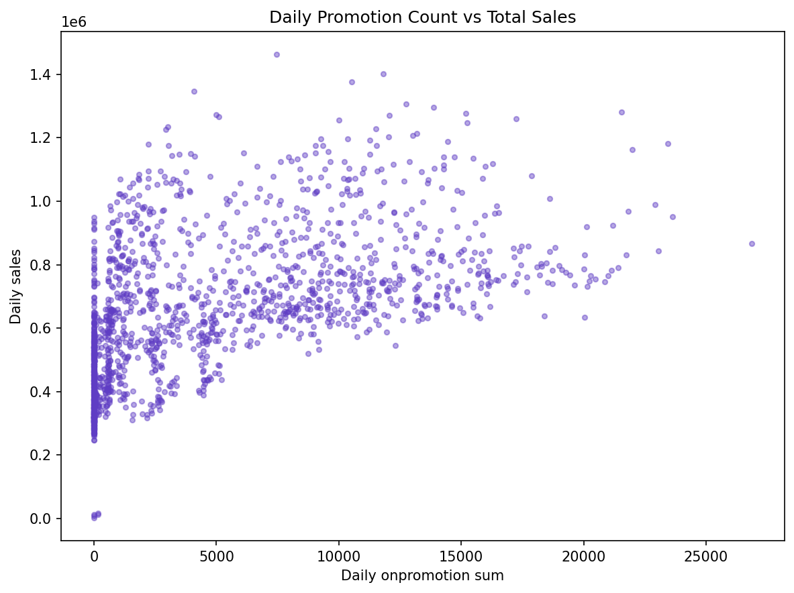
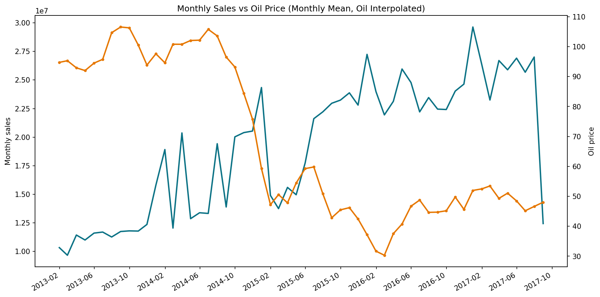
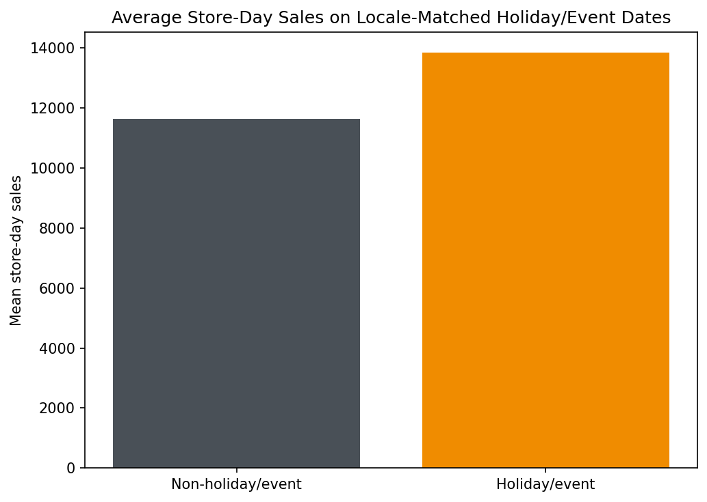
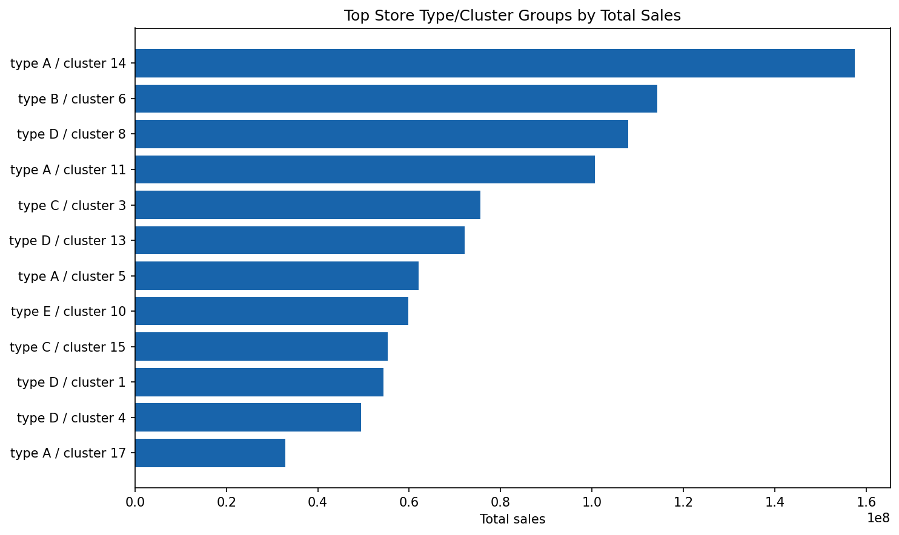
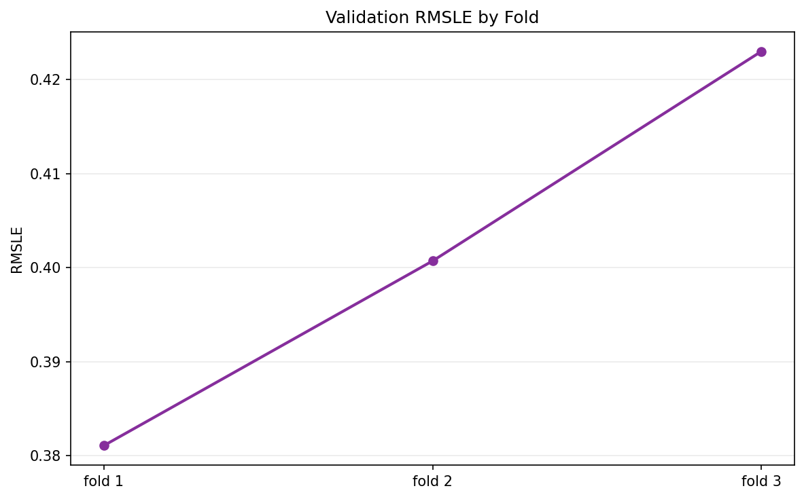

# Store Sales EDA Report

## Dataset Snapshot

- Train rows: `3,000,888`
- Test rows: `28,512`
- Train date range: `2013-01-01` to `2017-08-15`
- Test date range: `2017-08-16` to `2017-08-31`
- Stores: `54`
- Families: `33`
- Total train sales: `1,073,645,056.00`
- Zero-sales row rate: `31.30%`
- Mean onpromotion per row: `2.6028`

## Key Observations

- Sales show strong calendar structure, so validation must remain time-based.
- Zero-sales behavior is material and differs strongly by family, so low-demand families need explicit attention.
- Promotions are a legal future-known signal in `test.csv`; richer promotion features are a high-priority modeling direction.
- The oil and holiday/event views should be treated as explanatory context rather than standalone causal proof.
- Holiday/event comparisons are matched to national, regional, and local store scope; oil monthly means are interpolated for continuity.
- The fold chart is useful for checking whether a feature improves only one holdout or is stable across time.

## Top Families by Sales

| family | total_sales | zero_sales_rate |
| --- | --- | --- |
| GROCERY I | 343,462,720.0000 | 0.0806 |
| BEVERAGES | 216,954,480.0000 | 0.0806 |
| PRODUCE | 122,704,688.0000 | 0.2836 |
| CLEANING | 97,521,288.0000 | 0.0806 |
| DAIRY | 64,487,708.0000 | 0.0806 |
| BREAD/BAKERY | 42,133,944.0000 | 0.0806 |
| POULTRY | 31,876,004.0000 | 0.0808 |
| MEATS | 31,086,468.0000 | 0.0806 |

## Figures

## Generated Tables

- `tables/dataset_overview.csv`
- `tables/family_summary.csv`
- `tables/store_cluster_summary.csv`
- `tables/holiday_summary.csv`

## Suggested Next EDA Checks

1. Compare the last 90 training days against the public-test period calendar and promotions.
2. Break down validation errors by `family`, `store_nbr`, and zero-sales-heavy groups.
3. Inspect promotion response by family before adding more model features.
4. Check whether holiday/event windows explain the worsening late validation folds.
