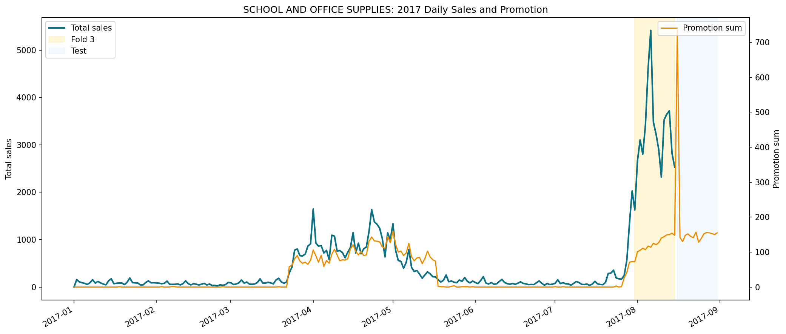
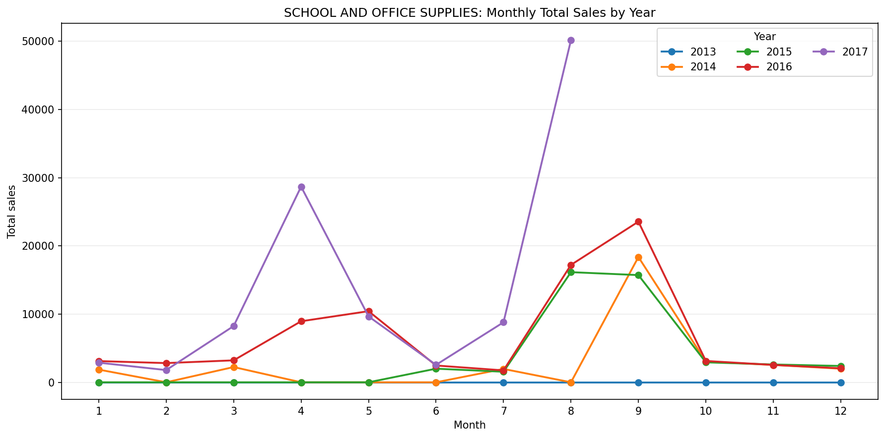
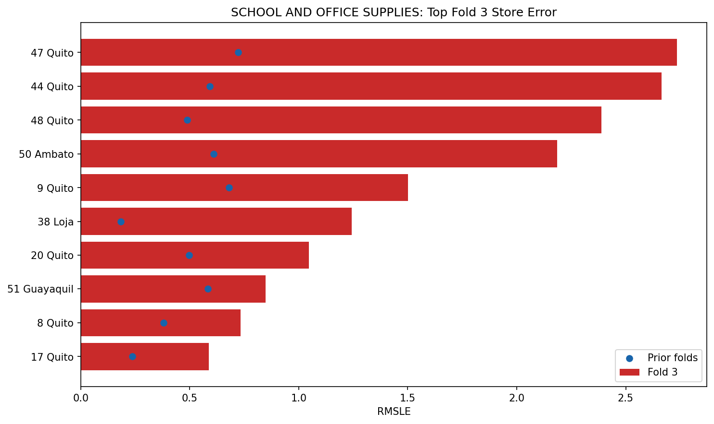

# Family Focus Analysis: SCHOOL AND OFFICE SUPPLIES

This report diagnoses one family after fold 3 cross-error analysis. It does not change the model.

## Key Findings

- August 2017 total sales for this family are `50169`, much higher than July 2017 and prior August levels.
- Fold 3 prediction error is concentrated in high-promotion type A / Quito-Ambato store segments for `SCHOOL AND OFFICE SUPPLIES`.
- Top fold 3 store segment: store `47` in `Quito`.
- Test-period promotions continue to be high for type A stores, so this family remains relevant for submission risk.
- Strongest new fold 3 store-promotion segment: store `47` with promotion bin `11-50`, actual mean `538.4`, predicted mean `33.6`.

## Fold Summary

| fold_id | row_count | rmsle | mean_actual_sales | mean_predicted_sales | mean_signed_error | mean_onpromotion |
| --- | --- | --- | --- | --- | --- | --- |
| 1 | 864 | 0.434057 | 1.366898 | 1.274311 | -0.092587 | 0.002315 |
| 2 | 864 | 0.641590 | 7.063657 | 1.332382 | -5.731276 | 0.250000 |
| 3 | 864 | 0.866511 | 59.947917 | 18.501496 | -41.446421 | 2.297454 |

## Monthly History Snapshot

| year | month | total_sales | promotion_sum | mean_sales | mean_onpromotion |
| --- | --- | --- | --- | --- | --- |
| 2013 | 9 | 0.000000 | 0 | 0.000000 | 0.000000 |
| 2014 | 3 | 2235.000000 | 0 | 1.335125 | 0.000000 |
| 2014 | 4 | 0.000000 | 0 | 0.000000 | 0.000000 |
| 2014 | 7 | 1958.000000 | 0 | 1.169654 | 0.000000 |
| 2014 | 8 | 0.000000 | 0 | 0.000000 | 0.000000 |
| 2014 | 9 | 18367.000000 | 153 | 11.337654 | 0.094444 |
| 2015 | 3 | 0.000000 | 0 | 0.000000 | 0.000000 |
| 2015 | 4 | 0.000000 | 0 | 0.000000 | 0.000000 |
| 2015 | 7 | 1545.000000 | 1 | 0.922939 | 0.000597 |
| 2015 | 8 | 16148.000000 | 350 | 9.646356 | 0.209080 |
| 2015 | 9 | 15719.000000 | 404 | 9.703087 | 0.249383 |
| 2016 | 3 | 3218.000000 | 2 | 1.922342 | 0.001195 |
| 2016 | 4 | 8950.000000 | 873 | 5.524692 | 0.538889 |
| 2016 | 7 | 1746.000000 | 0 | 1.043011 | 0.000000 |
| 2016 | 8 | 17214.000000 | 2271 | 10.283154 | 1.356631 |
| 2016 | 9 | 23556.000000 | 1679 | 14.540741 | 1.036420 |
| 2017 | 3 | 8246.000000 | 648 | 4.925926 | 0.387097 |
| 2017 | 4 | 28689.000000 | 3037 | 17.709259 | 1.874691 |
| 2017 | 7 | 8797.000000 | 290 | 5.255078 | 0.173238 |
| 2017 | 8 | 50169.000000 | 1913 | 61.937038 | 2.361728 |

## Fold 3 Store Error

| store_nbr | city | store_type | cluster | fold3_rmsle | prior_rmsle | rmsle_delta | fold3_mean_actual_sales | fold3_mean_predicted_sales | fold3_mean_onpromotion |
| --- | --- | --- | --- | --- | --- | --- | --- | --- | --- |
| 47 | Quito | A | 14 | 2.735861 | 0.721499 | 2.014362 | 523.437500 | 32.604855 | 12.000000 |
| 44 | Quito | A | 5 | 2.665396 | 0.591897 | 2.073498 | 393.750000 | 25.889929 | 12.000000 |
| 48 | Quito | A | 14 | 2.388825 | 0.487357 | 1.901467 | 394.375000 | 31.009835 | 10.625000 |
| 50 | Ambato | A | 14 | 2.185463 | 0.609607 | 1.575855 | 390.125000 | 45.756371 | 11.875000 |
| 9 | Quito | B | 6 | 1.502361 | 0.679495 | 0.822865 | 147.500000 | 32.335412 | 8.250000 |
| 38 | Loja | D | 4 | 1.244050 | 0.182788 | 1.061263 | 4.937500 | 0.208907 | 0.000000 |
| 20 | Quito | B | 6 | 1.046808 | 0.497943 | 0.548866 | 58.875000 | 19.040189 | 5.562500 |
| 8 | Quito | D | 8 | 0.733580 | 0.380644 | 0.352937 | 1.562500 | 0.403717 | 0.000000 |
| 51 | Guayaquil | A | 17 | 0.847989 | 0.584243 | 0.263745 | 3.875000 | 4.396971 | 0.000000 |
| 17 | Quito | C | 12 | 0.588754 | 0.235964 | 0.352790 | 11.562500 | 4.956986 | 2.000000 |

## Fold 3 Store Promotion Error

This table prioritizes segments that can be compared against prior folds. Fold 3-only high-promotion segments are shown in the next table.

| store_nbr | city | store_type | promotion_bin | fold3_row_count | fold3_rmsle | prior_rmsle | rmsle_delta | fold3_mean_actual_sales | fold3_mean_predicted_sales |
| --- | --- | --- | --- | --- | --- | --- | --- | --- | --- |
| 38 | Loja | D | 0 | 16 | 1.244050 | 0.182788 | 1.061263 | 4.937500 | 0.208907 |
| 9 | Quito | B | 6-10 | 15 | 1.501075 | 0.893248 | 0.607827 | 145.200000 | 31.893541 |
| 8 | Quito | D | 0 | 16 | 0.733580 | 0.380644 | 0.352937 | 1.562500 | 0.403717 |
| 51 | Guayaquil | A | 0 | 16 | 0.847989 | 0.584243 | 0.263745 | 3.875000 | 4.396971 |
| 43 | Esmeraldas | E | 0 | 16 | 0.728408 | 0.574448 | 0.153959 | 2.312500 | 2.392455 |
| 36 | Libertad | E | 0 | 16 | 0.620042 | 0.455046 | 0.164996 | 1.125000 | 0.442490 |
| 52 | Manta | A | 0 | 16 | 0.695197 | 0.578471 | 0.116727 | 6.000000 | 3.432703 |
| 3 | Quito | D | 0 | 16 | 0.510927 | 0.369670 | 0.141258 | 1.000000 | 1.165598 |
| 26 | Guayaquil | D | 0 | 16 | 0.505743 | 0.428631 | 0.077112 | 0.812500 | 0.446550 |
| 31 | Babahoyo | B | 0 | 15 | 0.631314 | 0.568273 | 0.063041 | 1.466667 | 1.639388 |

## New Fold 3 Store Promotion Segments

These store-promotion combinations appear in fold 3 but not in prior folds for this family.

| store_nbr | city | store_type | promotion_bin | fold3_row_count | fold3_rmsle | fold3_error_share | fold3_mean_actual_sales | fold3_mean_predicted_sales |
| --- | --- | --- | --- | --- | --- | --- | --- | --- |
| 47 | Quito | A | 11-50 | 15 | 2.733045 | 0.172712 | 538.400000 | 33.601619 |
| 44 | Quito | A | 11-50 | 15 | 2.697563 | 0.168257 | 414.200000 | 26.982084 |
| 48 | Quito | A | 11-50 | 13 | 2.561915 | 0.131526 | 464.846154 | 35.381392 |
| 50 | Ambato | A | 11-50 | 15 | 2.254764 | 0.117552 | 416.000000 | 48.574898 |
| 20 | Quito | B | 6-10 | 9 | 1.243681 | 0.021458 | 84.333333 | 23.288004 |
| 17 | Quito | C | 6-10 | 4 | 1.001215 | 0.006181 | 40.250000 | 15.014303 |
| 39 | Cuenca | B | 1 | 4 | 0.960298 | 0.005686 | 7.750000 | 3.193696 |
| 10 | Quito | C | 2-5 | 4 | 0.904469 | 0.005044 | 8.750000 | 3.104608 |
| 15 | Ibarra | C | 2-5 | 7 | 0.657461 | 0.004664 | 9.857143 | 7.222817 |
| 11 | Cayambe | B | 6-10 | 9 | 0.509424 | 0.003600 | 27.666667 | 19.293776 |

## Test Promotion Risk Overlap

| store_nbr | city | store_type | promotion_bin | test_row_count | test_mean_onpromotion | test_promotion_sum | has_fold3_error_signal | fold3_rmsle | fold3_error_share |
| --- | --- | --- | --- | --- | --- | --- | --- | --- | --- |
| 50 | Ambato | A | 11-50 | 16 | 12.687500 | 203 | True | 2.254764 | 0.117552 |
| 46 | Quito | A | 11-50 | 16 | 12.687500 | 203 | True | 0.588554 | 0.006942 |
| 45 | Quito | A | 11-50 | 16 | 12.250000 | 196 | True | 0.896901 | 0.019840 |
| 44 | Quito | A | 11-50 | 16 | 12.062500 | 193 | True | 2.697563 | 0.168257 |
| 48 | Quito | A | 11-50 | 16 | 12.062500 | 193 | True | 2.561915 | 0.131526 |
| 47 | Quito | A | 11-50 | 15 | 12.466667 | 187 | True | 2.733045 | 0.172712 |
| 49 | Quito | A | 11-50 | 15 | 12.266667 | 184 | True | 0.355467 | 0.002922 |
| 9 | Quito | B | 6-10 | 15 | 8.133333 | 122 | True | 1.501075 | 0.052100 |
| 20 | Quito | B | 6-10 | 11 | 8.090909 | 89 | True | 1.243681 | 0.021458 |
| 11 | Cayambe | B | 6-10 | 11 | 7.818182 | 86 | True | 0.509424 | 0.003600 |

## Figures

## Generated Tables

- `tables/monthly_history.csv`
- `tables/daily_2017_focus.csv`
- `tables/family_fold_summary.csv`
- `tables/family_fold3_store_error.csv`
- `tables/family_fold3_store_promotion_error.csv`
- `tables/family_fold3_new_store_promotion_segments.csv`
- `tables/test_promotion_risk_overlap.csv`

## Interpretation

- The evidence supports a targeted issue for this family, not a general low-demand fix.
- The data shows underprediction in fold 3 high-promotion type A / Quito-Ambato store segments.
- The next feature experiment should target August timing and promotion behavior for this family; a school-season explanation remains a hypothesis.
- This report is diagnostic; it does not prove the external business cause of the pattern.
